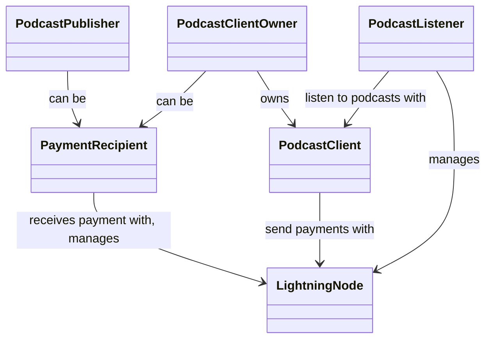

# Agents

* Podcast listener
* Podcast publisher
* Podcast client
* Podcast client owner
* Payment recipients
* Lightning Nodes

## Relationships

## Descriptions

### Podcast listener

The person that consumes (listen to) a podcast, using a _Podcast client_ software.

This agent decides how much value the listening experience has.

This agent requires access to a Lightning Node in order to send payments.

### Podcast publisher

The person responsible for publishing a podcasts and its episodes.

This agent is responsible for maintaining value and payment recipients for podcasts and its episodes.

This agent may be also a _Payment recipient_.

### Podcast client

The software used to listen podcasts.

This agent is responsible for storing value related options, valuating the listening time and triggering the payment to payment recipients by communicating with _Lightning Nodes_.

It is expected that this agent collect a fee on the payments.

### Podcast client owner 

The owner of the podcast client, typically its developer.

This agent is typically a _Payment recipient_, and receives payments corresponding to fee collected by the _Podcast client_.

### Payment Recipient

Any agent that receives payments through the _Lightning Network_.

Aside from _Podcast publishers_ and _Podcast client owners_, many roles in the ecosystem can by this agent, such as podcast guests, editors, charities, royalty owners, etc...

This agent requires access to a _Lighting Node_ in order to receive payments. 