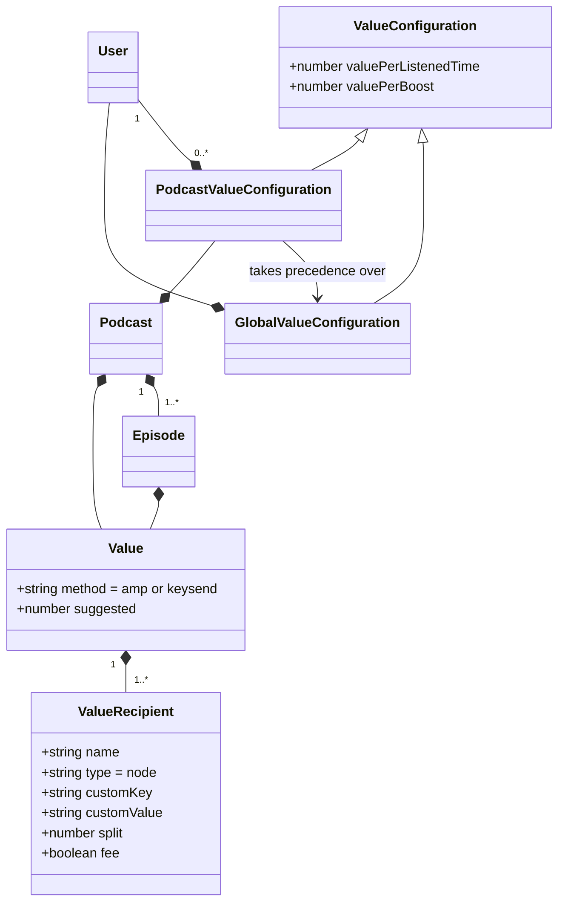

# Data Models

```mermaid
classDiagram
    Podcast *-- Value
    Podcast "1" *-- "1..*" Episode
    Episode *-- Value
    Value "1" *-- "1..*" ValueRecipient
    User --* GlobalValueConfiguration
    User "1" --* "0..*" PodcastValueConfiguration
    PodcastValueConfiguration --* Podcast
    ValueConfiguration <|-- PodcastValueConfiguration
    ValueConfiguration <|-- GlobalValueConfiguration
    PodcastValueConfiguration --> GlobalValueConfiguration: takes precedence over

    class Value {
        +string method = amp or keysend
        +number suggested
    }

    class ValueConfiguration {
        +number valuePerListenedTime
        +number valuePerBoost
    }

    class ValueRecipient {
        +string name
        +string type = node
        +string customKey
        +string customValue
        +number split
        +boolean fee
    }
```